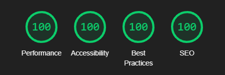

*In English* | *[На русском](readme.ru.md)*

# Retirement home chain website

Static files and a static website [hosted on GitHub Pages](https://dimitri-tikhomirov.github.io/lastochka-website/) are located in the `public/` folder.

The website design was done from scratch, including photo editing and mockup creation.

All programming was done manually, including elements such as:

- Adaptive, progressively collapsing menu that transitions to a mobile menu on small screens.
- The header shrinks in size and becomes fixed ("sticky") when scrolling.
- Smooth scrolling to website sections.
- Lazy loading of photos, video thumbnails, and the integrated map.
- Justified layout without gaps of photos of different sizes.
- Image slider with lazy loading, keyboard navigation, and swipe navigation.
- Asynchronous form submission.
- Server-side part for sending emails using Node.js with the Nodemailer module.

CSS and JS files are divided into sections that you can switch between by searching for `/**`.

The actual website is hosted on a VPS using PM2, with Nginx as a reverse proxy, and an SSL certificate from Let's Encrypt.

At the time of creation, the website receives the highest quality ratings from Google:

